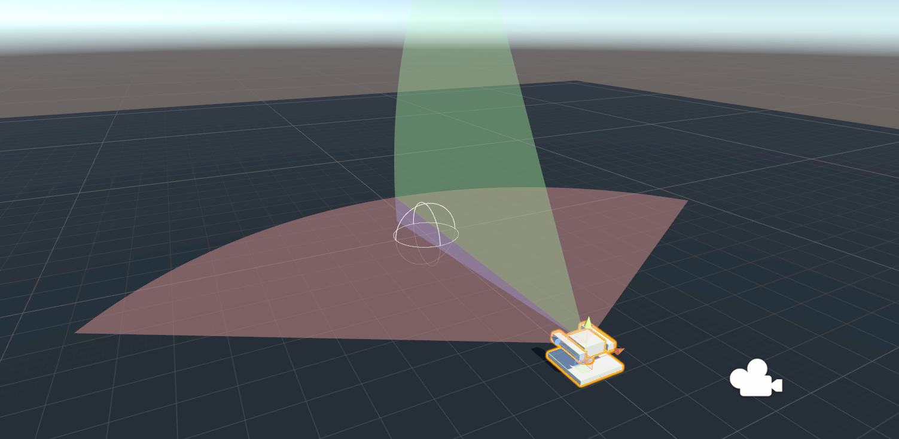

# Gun Turrets
Starting point for turrets that can be mounted on objects that move and can be at any arbitrary rotation. This only project specifically works out the rotation of turrets. You're meant to provide your own weapon systems and to pass aim points to the turret on your own.

Built in **Unity 5.6.4**.

## Download

You can either clone the repository or download the asset package located in the root.

## Usage

To aim the turret, call the function **SetAimpoint**. This function takes a Vector3 position. If the turret is not currently idle, it will turn to aim at this target.

At any time, the turret can be put into (or out of) Idle mode using the **SetIdle** function. When the turret is idle, it will return to its resting position. Note that the aimpoint remains, and if the turret is brought out of idle, it will continue to aim at whatever the last aimpoint was set to.

## Turret Rotation

The core script of this project. This assumes a turret with a base gameobject/transform for horizontal rotation, and a barrel gameobject/transform for the vertical rotation. This covers the majority of cases for how turrets operate.

Included in the project is an archetype prefab that can be used as a basis for any turrets you might need to create. It's already configured, and only requires you to customize it to your needs and swap out the models.

## Turret Hierarchy

Turrets must follow a specific hierarchy. The image below shows an example.

An **empty gameobject**, (TurretAchetype) must be the root object. This is the gameobject with the TurretRotation script on it.

The **turret base object** (Base) must then be a child of the root object. This game object handles the horizontal rotation of the turret.

Finally, the **barrels object** (Barrels) must be a child of the turret base object. This object handles the elevation of the barrels. If you add a gun or missile launcher to the turret, it's recommended to make the gun a child of this barrel object.

The rest of the objects in the hierarchy screenshot above are for visuals.

If an elevating barrel isn't required for the turret, it will function just fine without it. The turret will continue to rotate horizontally to face whatever aim point it's given, but 

## Helper tools

### Show Arcs

Visualizes the firing arcs of the turret. Note that this only works correctly at edit-time. During runtime the arcs will not be accurate.

- Red: Azimuthal left/right limits. How far to the left/right that the turret can turn.
- Green: Elevation. How far the turret can raise its barrels.
- Blue: Depression. How far the turret can lower its barrels.

### Auto-Populate Transforms

This button will automatically fill in the Turret Base and Turret Barrels game objects. It will search for a child of the turret game object with the name "Base" for the base, and a child of that game object with name "Barrels" for the turret barrels.

### Clear Transforms

Simply sets the turret base and barrels to None.
